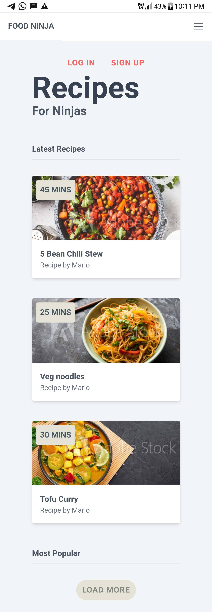
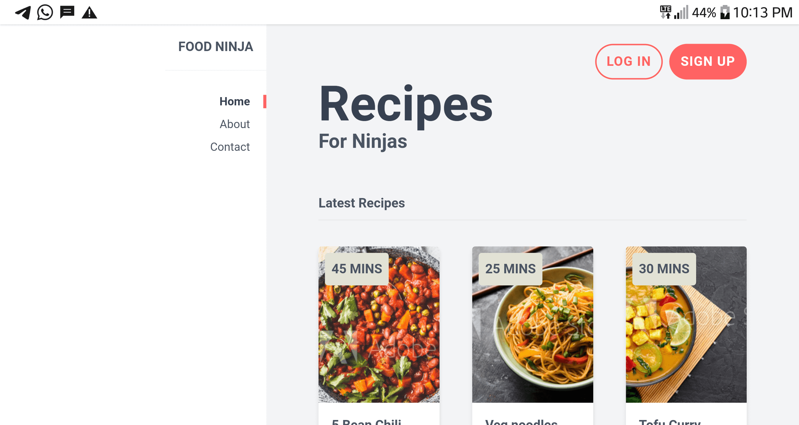

# Food-Ninja
Home page for Recipe website, Created with Tailwind

## Table of contents

- [Overview](#overview)
  - [Screenshot](#screenshot)
  - [Links](#links)
- [My process](#my-process)
  - [Built with](#built-with)
  - [What I learned](#what-i-learned)
  - [Continued development](#continued-development)
  - [Useful resources](#useful-resources)
- [Author](#author)

## Overview

### Screenshot

### Links

- Live Site URL: [Here](https://jacbfrancis.github.io/Food-Ninja/)

## My process

### Built with

- Semantic HTML5 markup
- Tailwind CSS
- Flexbox
- Grid
- Responsive web design

### What I learned

- I learnt how to use Tailwind to style and Design web pages.

- I learnt how to use grid to align and distribute space within a container.

### Continued development

• Learn and build projects with JavaScript.

### Useful resources

- [Tailwind CSS crash course by Netninja](https://m.youtube.com/playlist?list=PL4cUxeGkcC9gpXORlEHjc5bgnIi5HEGhw) - This crash course thought me how to use and customize Tailwind classes.

- [Tailwind Documentation ](https://tailwindcss.com) - This website provides alot of information and instructions on how to use Tailwind.

## Author

- Github - [ Francis Jacob](https://github.com/Jacbfrancis)
- Twitter - [@jacobxavier_](https://twitter.com/jacobxavier_?t=YdJHQngdQYJVbC7mWspqDg&s=08)

