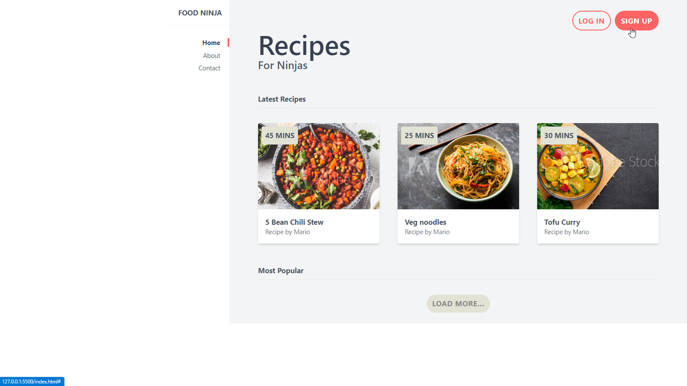

# Food-Ninja
Home page for Recipe website, Created with Tailwind

## Table of contents

- [Overview](#overview)
  - [Screenshot](#screenshot)
  - [Links](#links)
- [My process](#my-process)
  - [Built with](#built-with)
  - [Continued development](#continued-development)
  - [Useful resources](#useful-resources)
- [Author](#author)

## Overview

### Screenshot

### Links

- Live Site URL: [Live site](https://jacbfrancis.github.io/Food-Ninja/)

## My process

### Built with

- Tailwind CSS

### Continued development

- Learn JavaScript.

### Useful resources

- [Tailwind CSS crash course by Netninja](https://m.youtube.com/playlist?list=PL4cUxeGkcC9gpXORlEHjc5bgnIi5HEGhw).

- [Tailwind Documentation ](https://tailwindcss.com)

## Author

- Twitter - [@jacobxavier_](https://twitter.com/jacobxavier_?t=YdJHQngdQYJVbC7mWspqDg&s=08)

